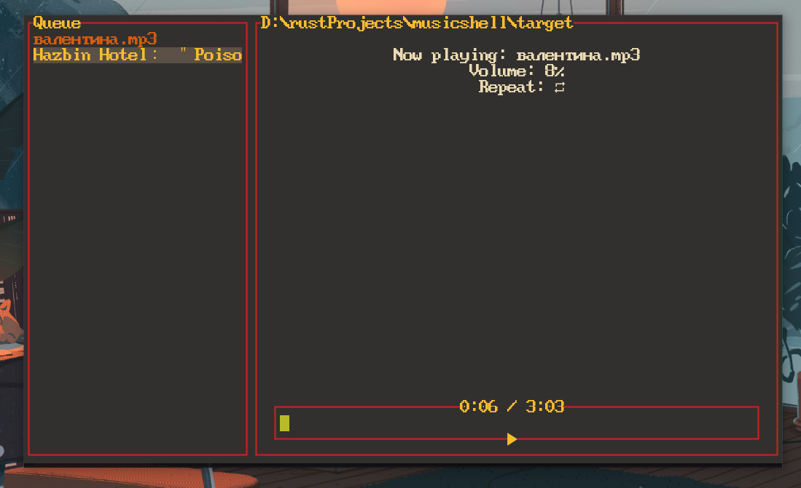
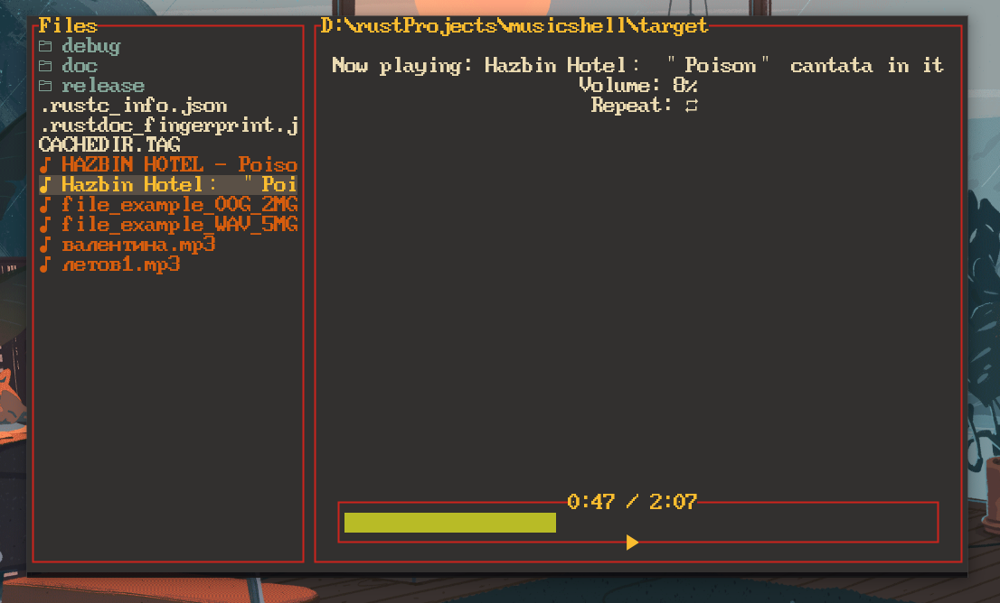
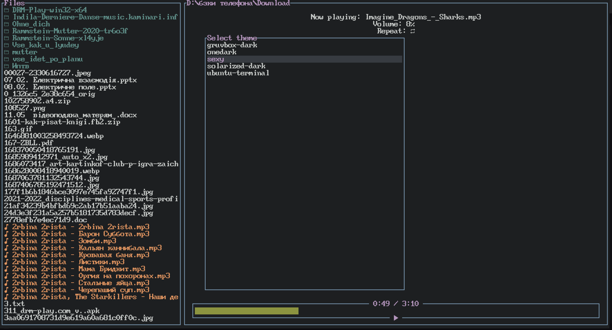
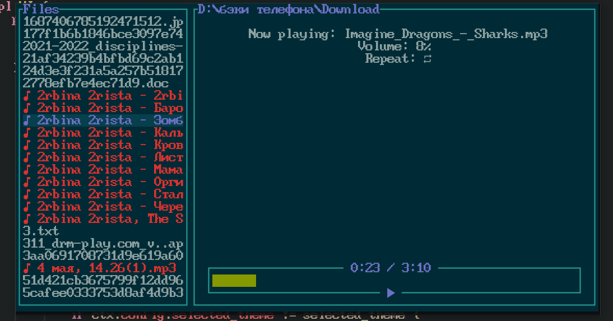

# A cross-platform TUI music player written in rust
### Gruvbox-dark theme


### Theme from terminal.sexy (I can't remember name)

### Solarized-dark

## Dependencies
* [Nerd fonts](https://www.nerdfonts.com/font-downloads)
* Cargo and rust
## Installation
```sh
git clone https://github.com/zloykotept/musicshell
cd musicshell
cargo build --release
```
Than check target/release folder
## Controls
Check sample_config/config.toml for keymaps
Config file linked to the program is located in your $HOME/.config/musicshell/ on linux  
And C:\Users\Name\.config\musicshell\ on Windows
## Issues
Rodio depends on [symphonia decoding library](https://github.com/pdeljanov/Symphonia) and sometimes it just can't extract full duration of mp3 file. Maybe I don't understand how do mp3 codecs work good enough. But re-encoding via [this](https://online-audio-converter.com) site always helped me.
## Goals
* ✔ Theme selector
* Search files
* ✔ Playlists
* Play radio streams
